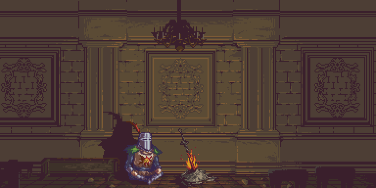

<h1 align="center">
	
</h1>

	

### 💫 About Me

- 🎓 Soy **desarrollador de software**.  
- 🔮 Aspiro a convertirme en **ingeniero en análisis de datos e inteligencia artificial**.  
- ❤️ Me apasiona la **automatización**, aprender **nuevas tecnologías** y aplicar **principios de código limpio**.  
- 🔭 Actualmente estoy aprendiendo **C#** y **.NET**.  
- 📫 Puedes contactarme en **isaacrvillacis@gmail.com**  

---

# 💻 Tech Stack:
**🧠 Lenguajes:**  
      

**⚙️ Frameworks & Librerías:**  
      

**🗄️ Bases de Datos:**  
   

**🧰 Herramientas & Otros:**  
 
---

---

### 🚀 Proyectos 

<table>
    <td width="50%">
        <h3 align="center">BackupCenter 💾</h3>
        

            
            

                
            

            

Sistema de gestión de respaldos empresariales con ejecución automática y manual, validación de integridad (SHA-256) y control de acceso. Backend en .NET 8 y frontend en Angular 18.

        

    </td>
    <td width="50%">
        <h3 align="center">Viveres Taty 🧺</h3>
        

            
            

                
            

            
Aplicación móvil desarrollada para la gestión eficiente de productos, deudas y pedidos en tiendas de víveres. Permite visualizar y actualizar productos, administrar deudas con pagos parciales en tiempo real y exportación en PDF

        

    </td>
</table>

<table>
    <td width="50%">
        <h3 align="center">Tetris Game 🎮</h3>
        

            
            

                
            

            
Aplicación móvil para jugar Tetris, registrar puntuaciones y gestionar tu perfil. <strong>Desarrollada con React Native y Firebase</strong>.

        

    </td>
    <td width="50%">
        <h3 align="center">Aprendiendo Redes Sociales 📱</h3>
        

            
            

                
            

            
Aplicación para ayudar a adultos mayores a aprender a usar redes sociales. <strong>Desarrollada con Angular 16</strong>.

            
<a href="https://frvillai.github.io/Redes-Sociales/">🔗 Ver despliegue</a>

        

    </td>
</table>

---

## 🌐 Socials:

---

# 📊 GitHub Stats

<table>
  <tr>
    <td>
      
    </td>
    <td>
      
    </td>
  </tr>
</table>
